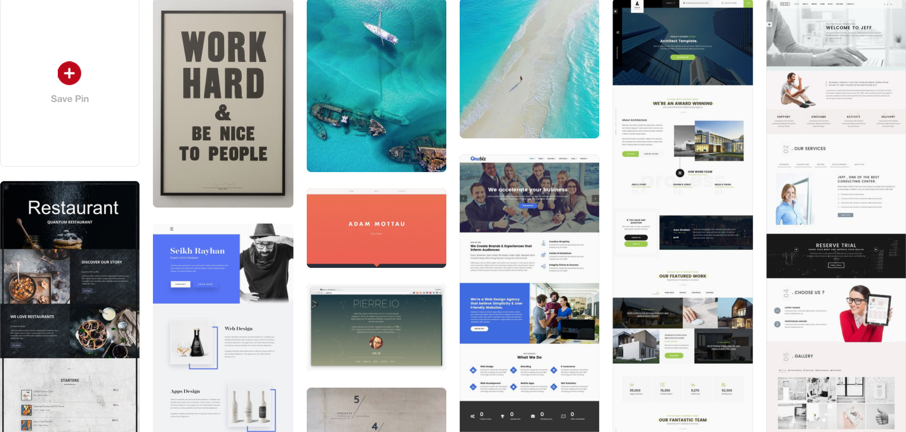
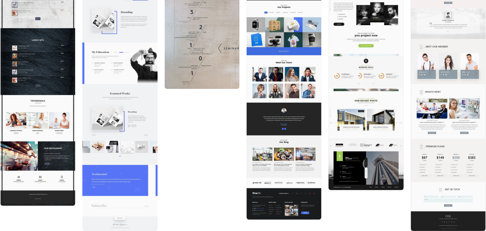
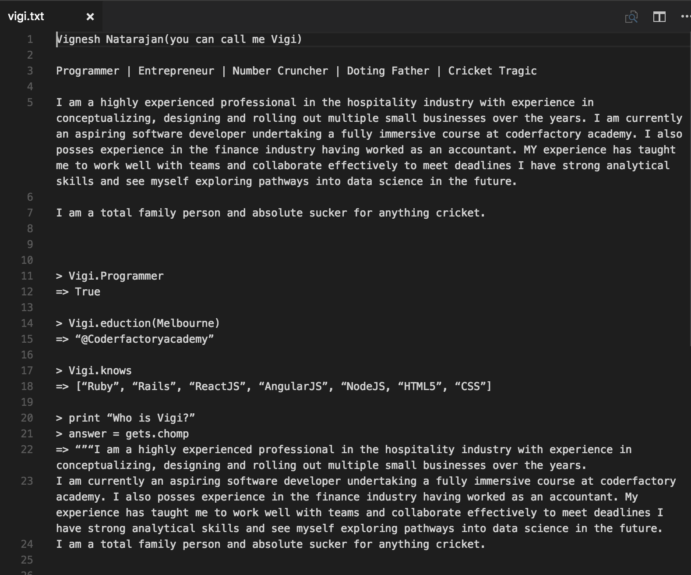
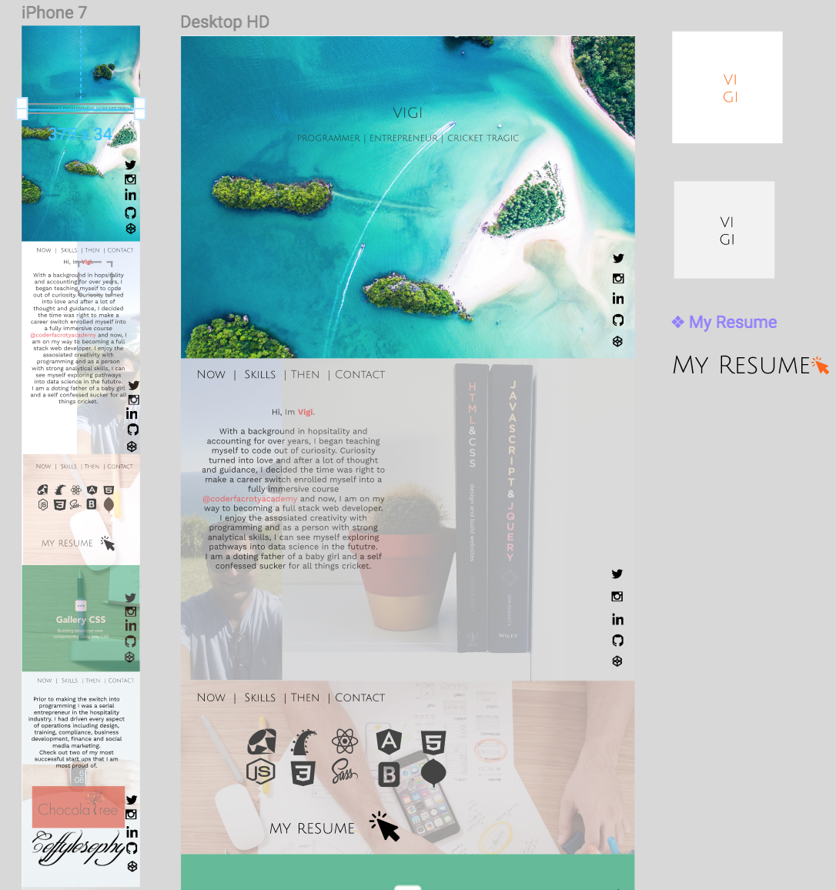
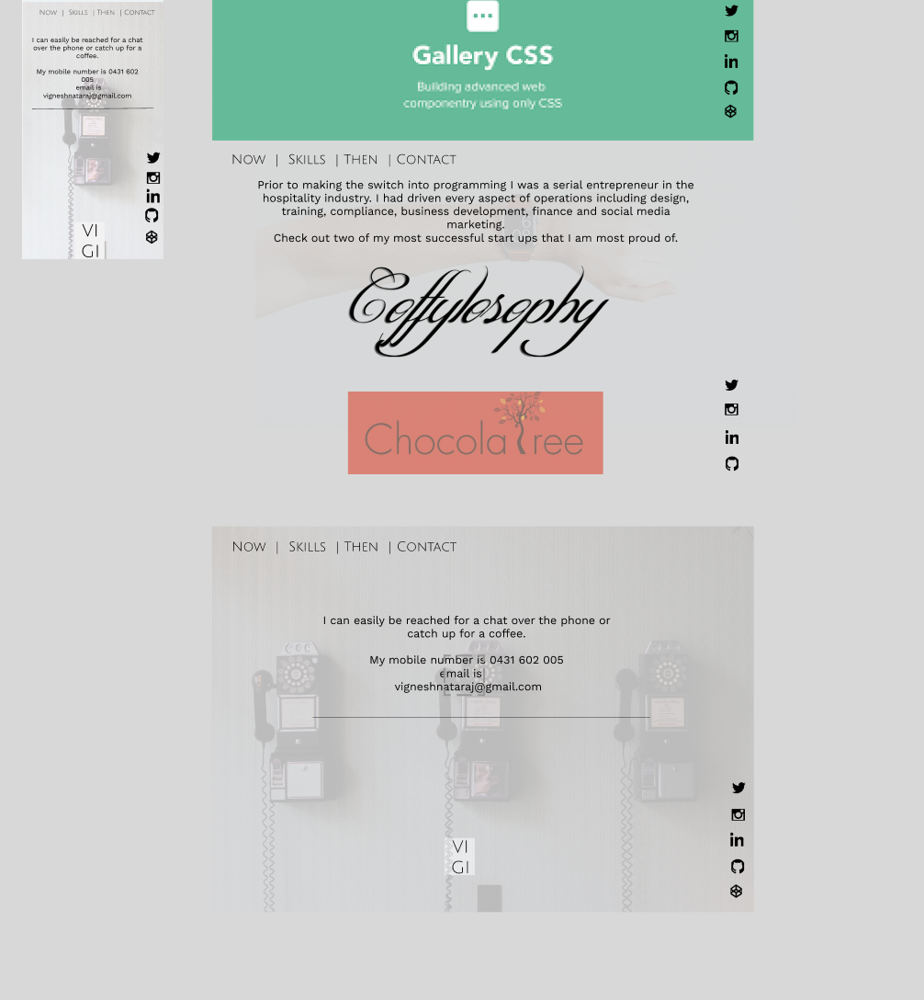
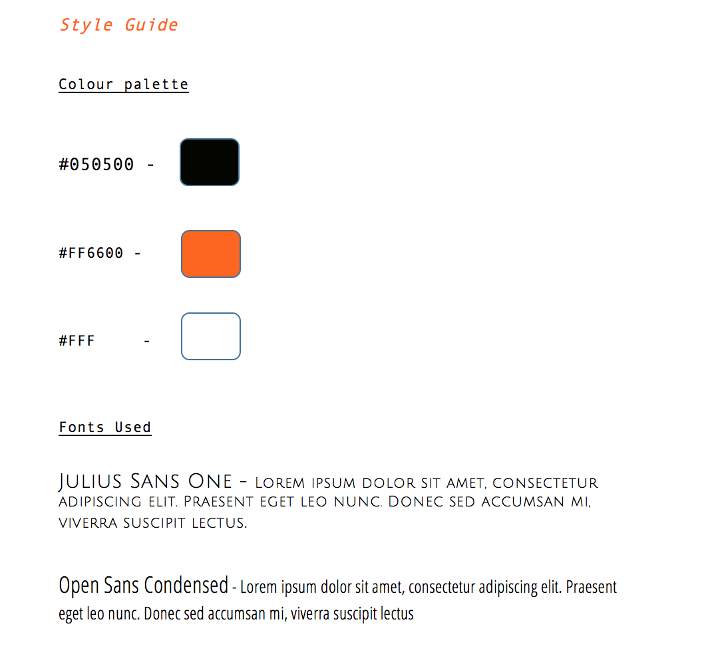
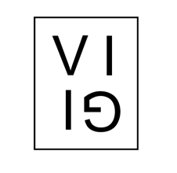

### https://ifollowedthewhiterabbit.github.io

# DESIGN PROCESS

### Target audience and message

The first thing I had to consider while creating this website was “who am I creating this website for” – prospective employers, my fellow students at coderfactory academy, friends, family and also myself. This website, being my first project of any real substance (smaller projects aside), I really wanted to test the boundaries of my capabilities. 

### Conceptualisation

At first glance, I wanted to deliver a small brief of who I am, what I do and what I have done in the past without divulging into too much information.

Even though I am at an early stage in my learning process of programming and web development, I still had to think ahead and set up a custom template that would be flexible enough to alter inevitable future value additions to my skills.

I also wanted to keep my design clean and neat and avoid any clutter of information of design elements.

### Influence

I started off by creating a mood board on Pinterest on designs and images that caught my eye. I really wanted a simple design which would be easy on the eye, and at the same time deliver the message I wanted to get across in an elegant manner.
It became evident to me soon that I would make a single page website with about 4-5 sections and each section serving as a entire page height with some sort of a meaningful background.

### The content

The content I wanted to display at first glance was a brief about myself, my skills, links to social media, past work and a contact form.

Below is an initial mock up of what I thought of including in as content.

As you can see, I soon realised I was overcomplicating things by trying to portray information as I would in a terminal. So I decided to cut back on the gimmicks, keep it simple and only have the the message I want to convey on display. This was kind of liberating for me in a design aspect as I gained clarity to keep things really simple. 

### The wireframe

To make a mock up of my website, I used figma as a design tool.

I wanted my landing page to be catchy and warm at the same time. I really liked the idea of using a photo taken from a drone and the idea of felt that an aerial shot of a beach might be a good idea (thinking it might bring out a warm and welcoming feel). 

I wanted the sections that followed to have a background as well, but emphasise on the content more. To achieve this, I blurred the background images.

Upon viewing my website, you will see that it slightly varies from the wireframe. This was mainly due to limitations and UI problems such as using a carousel in a mobile device and the developer icons not looking as good (personal opinion) as just having skills laid out in plain text.

# Starting to code the website

### Language

I had limited knowledge in HTML and CSS and had created a couple web pages in the past using the bootstrap library. But I wanted to use plain vanilla CSS and avoid using any frameworks just so I could get familiar with the basics. I had to use Javascript in a few places but I have kept this to a minimum and mainly concentrated on getting my head around CSS.

### Style Guide

### Approach and challenges encountered

I now know why CSS can be a pain like everyone says it is. Since my knowledge of CSS was very basic I was exposed to a lot of different limitations that I did not know about.

Initially, I had gone with a desktop first approach and soon found it very hard to scale down. Once I reverted to a mobile first approach things got much easier, but I still faced a lot of challenges. 

Obviously the biggest challenge was to get everything working properly across all devices and sizes. Also, a major hurdle was that of making a fixed background image working on mobile or tablet. By the time I had figured out what needed to be done, I was far too committed to go back to the drawing board and start over again. This however, is something I am going to work on in the future. So, for now I have had to disable fixed backgrounds touch devices but it works great on desktops and laptops.

### Additional skills learned

Through this experience I have also taken interest in learning other tools such as Adobe photoshop and illustrator.

# The Website

### Section 1

This is the landing page and it has a bright blue aerial image and with my name and three key attributes to describe who I am.

There is also a cool box animation while hovering over my name.

Links to social media are are in the bottom right and are fixed all through the website.

### Section 2

Starts off with a navbar which is fixed (using JS) from this point onwards.

A brief about me, what I am doing now, future aspirations and interests. 

At the bottom is also a link to my resume for a more serious look into what I can bring to the table

### Section 3

Displays my skillset in three sections without the need to explain each skill that I have acquired – self explanatory.

At the bottom are links to my projects.

### Section 4

A gist of my latest work experience as an entrepreneur and links to a two of my most successful start ups.

### Section 5

A contact form is included using formspree (and some JS to keep bots from accessing my email).

Js was also included for smooth scroll which is a nice touch.

# Other //

All meta tags, sitemap and robots.txt file have been included.

### Favicon

# Tools & Resources
- Pen and paper
- Figma
- Codepen
- Adobe photoshop
- Adobe illustrator
- Flaticon.com
- Github
- Youtube
- Google chrome(predominantly) and other browsers to inspect
- Various phones, tablets and computers

# Improvements 
1.	Get the fixed background image working on touch devices.
2.	Implement scroll snap.
3.	Add effects when navbar fades in and out.

- Codepen
- Adobe photoshop
- Adobe illustrator
- Flaticon.com
- Github
- Youtube
- Google chrome(predominantly) and other browsers to inspect
- Various phones, tablets and computers

